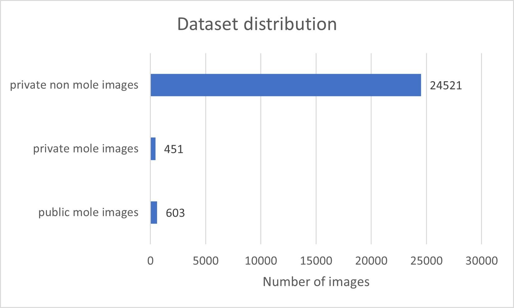
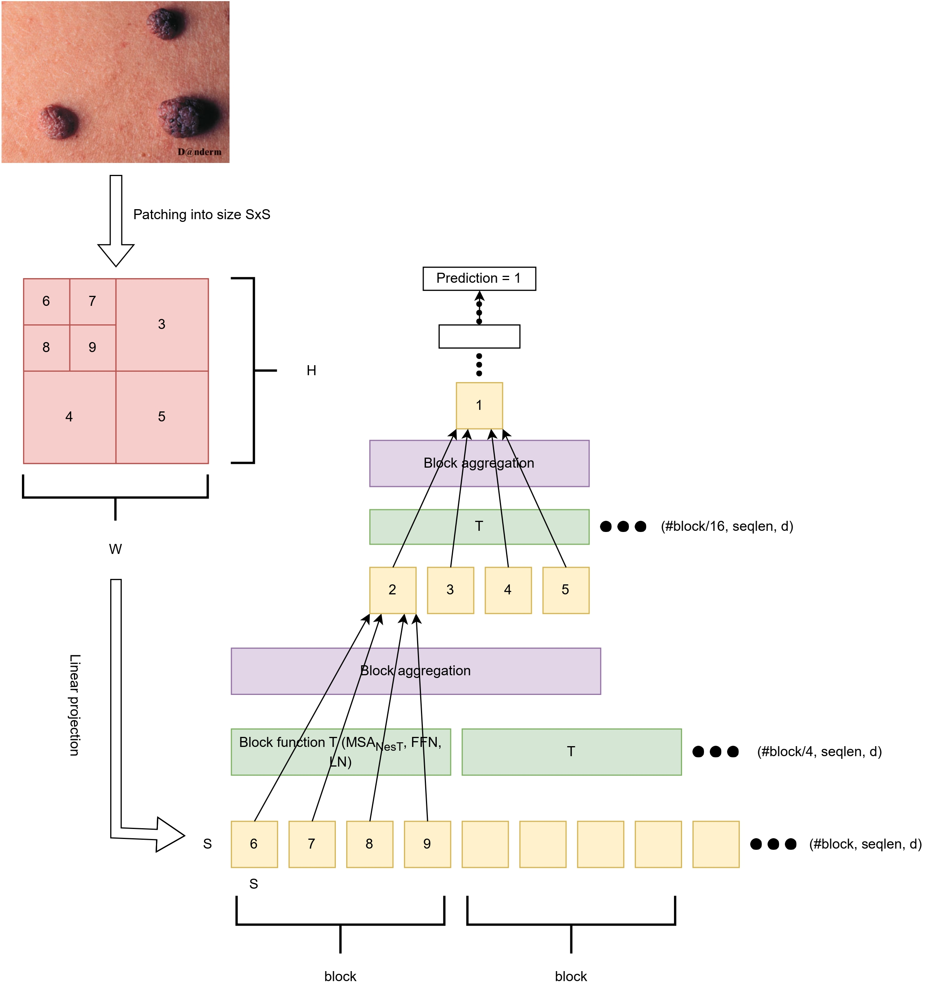

# AI-Assisted Mole Detection for Teledermatology Triage
**Triaging system via Vision Transformer (ViT) and Nested Hierarchical Transformer (NesT) to detect nevi from dermatological images**
*Codebase to the published study in Informatics in Medicine Unlocked (2023). Please feel free to take a look at the paper at https://doi.org/10.1016/j.imu.2023.101311*

---

## Overview

This repository implements an AI triage system that identifies **mole (nevus) presence** in patient-submitted skin photos to support online dermatology workflows. The goal is to act as a **first-line filter** that prioritizes recall on mole-positive images to minimize false negatives in clinical triage.

## Key Contributions

- **Clinical triage framing:** Optimizes for **high recall** on mole-positive cases while maintaining strong precision and accuracy.  
- **Transformer-based baselines:** Comparison of **NesT vs SOTA models** (prior to 2022) for this teledermatology use case.  
- **Reproducible splits:** Repository includes initial train/val/test CSV structures to standardize experiments

## Repository Structure

```text
mole-detection/
├─ src/                     # Model code, data pipeline, training/eval logic
├─ train.sh                 # Example training launcher
├─ requirements.txt         # Python dependencies
├─ setup.py                 # Optional installable package metadata
├─ train_set_initial.csv    # Train split manifest
├─ validation_set.csv       # Validation split manifest
└─ test_set_initial.csv     # Test split manifest
```

## Installation

```bash
git clone https://github.com/Debarpan98/mole-detection.git
cd mole-detection

python -m venv .venv && source .venv/bin/activate   # on Windows: .venv\Scripts\activate
pip install -r requirements.txt
```

## Data
The dataset used in this project was primarily curated by **OROHealth Inc.**, consisting of **24,972 images**. A major challenge was the **class imbalance**:

- Only **451 images** (≈1.8%) were labeled as *mole* cases.  
- To mitigate this, mole images from the **public Danderm dataset** were added, increasing the mole count to **1,054** (≈4.12%).  
- Even after augmentation, the dataset remained highly imbalanced, with ~96% of samples being *non-mole*.  
- For training stability, **sub-sampling** was applied — limiting to **no more than 600 images per class** in the final training set.



The repository ships with CSV manifests for the initial splits:

- `train_set_initial.csv`
- `validation_set.csv`
- `test_set_initial.csv`

Each CSV should map images to labels (binary: `mole` vs `no_mole`).  
If you are using your own data, replicate the same CSV format and update paths accordingly.

> **Tip:** Store images in any folder structure you prefer; the CSVs should contain absolute or project-relative paths plus the label column.  
> Keep class imbalance in mind when reporting metrics.

## Model Architecture


## Reproducing Paper-Level Results

- Use the provided split manifests to mirror the experimental protocol.  
- Evaluate both **ViT** and **NesT** under identical augmentations and training schedules.  
- For fair comparison, fix random seeds, log package versions, and pin dependency versions from `requirements.txt`.  

## Results Template

Best performing experiments of each model with onecycle scheduler with regards to recall in test images with moles
| Model | Gradient Accumulation Batch | Optimizer | Loss Function| Learning Rate | Mole Recall |
|-------|-----------------------------|-----------|--------------|---------------|-------------|
| BiT | 32 | Stochastic Gradient Descent | Assymetric Single Label | 0.03 | 0.8897 |
| InceptionV4 | 32 | Stochastic Gradient Descent | Assymetric Single Label | 0.01 | 0.8676 |
| NesT |  32 | Stochastic Gradient Descent | Assymetric Single Label | 0.001 | 0.9338 |
| ViT | 32 | Stochastic Gradient Descent | Assymetric Single Label | 0.0001 | 0.9011 |
| ViT_21k | 32 | Stochastic Gradient Descent | Assymetric Single Label | 0.0001 | 0.8676 |

Confusion Matrix of the best performing NesT model:

| True Label | Predicted Mole | Predicted Non-mole | Total |
|------------|----------------|--------------------|-------|
| Mole       | 127            | 9                  | 136   |
| Non-mole   | 7              | 277                | 284   |
| **Total**  | 145            | 275                | 420   |

## Ethical Use & Considerations

- The proposed system is a triage aid, not a diagnostic device. Human oversight is required.
- Needs further validation across diverse skin tones, devices, and capture conditions to reduce bias.

## How to Cite

If you use this repository in academic work, please cite the paper:

> D. Das, E. Ergin, B. Morel, M. Noga, D. Emery, K. Punithakumar.  
> **AI-assisted mole detection for online dermatology triage in telemedicine settings.**  
> *Informatics in Medicine Unlocked*, 2023, 41:101311.  
> doi:[10.1016/j.imu.2023.101311](https://doi.org/10.1016/j.imu.2023.101311)

```bibtex
@article{DAS2023101311,
title = {AI-assisted mole detection for online dermatology triage in telemedicine settings},
journal = {Informatics in Medicine Unlocked},
volume = {41},
pages = {101311},
year = {2023},
issn = {2352-9148},
doi = {https://doi.org/10.1016/j.imu.2023.101311},
url = {https://www.sciencedirect.com/science/article/pii/S2352914823001570},
author = {Debarpan Das and Elcin Ergin and Bruno Morel and Michelle Noga and Derek Emery and Kumaradevan Punithakumar},
}
```
